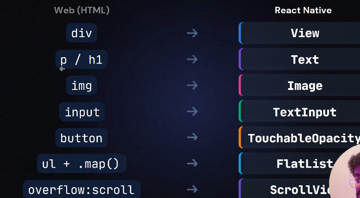
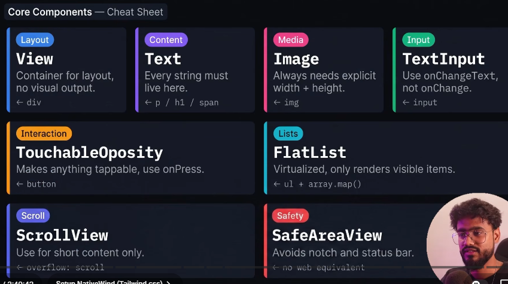
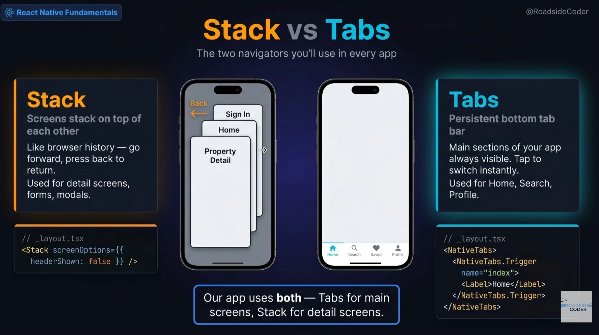
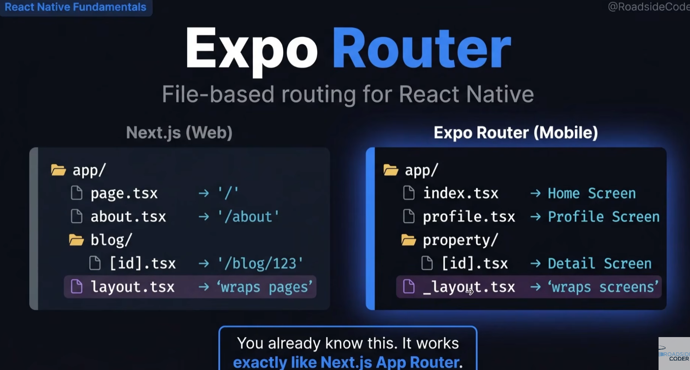
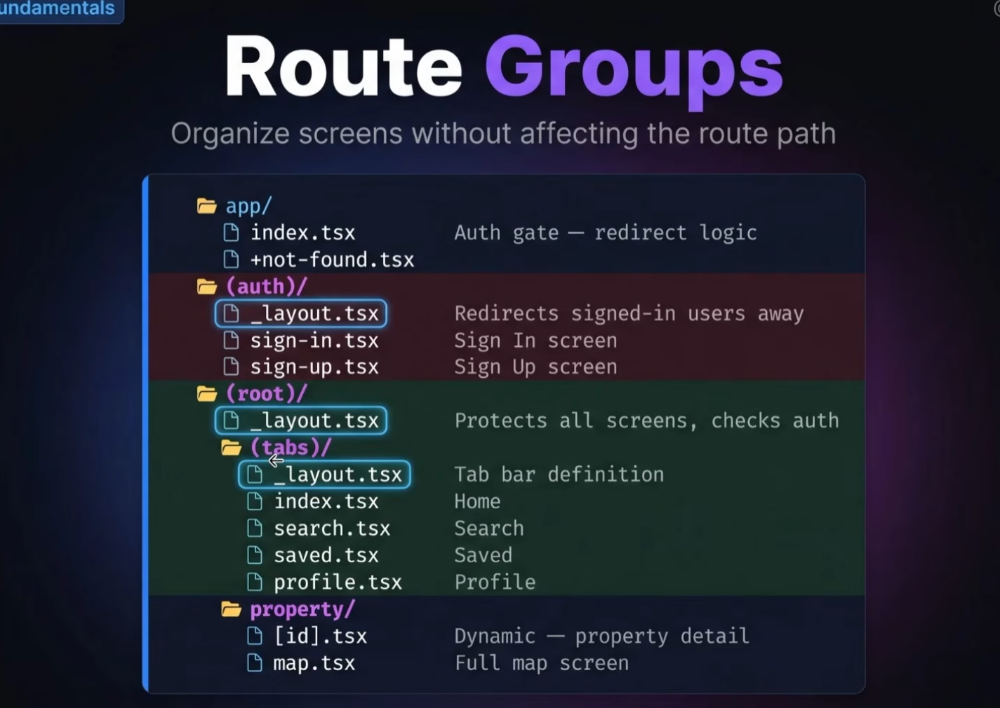

- npx create-expo-app@latest --template default@sdk-54 .
- then u can run reset to clear all the boilerplate code
- to start npx expo start
- error while running npx expo start, use npx expo start -- --port=8080 instead, got it from reddit.
- if you want to create tabs navigation use (tabs) file and keep all the stuffs over there.

- quick cheatsheet on the diff between DOM and Native:
- 

- texts related stuffs must always be wrapped in a <Text> Text </Text> component
- to built for notch phones, use
- <TouchableOpacity> as button, and here we have onPress instead of onClick

- cheatsheet for key components
  

- there are two types of navigation in react native.
  
- screens are placed on top of each other in stack naviation. <Slot> basically says, there will be no naviation.

- react native has file based routing just like next.js
  

- route groups in expo
  
